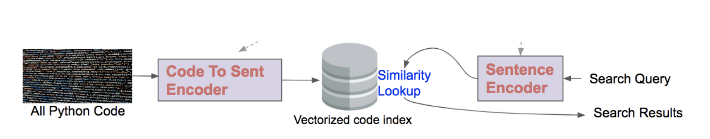
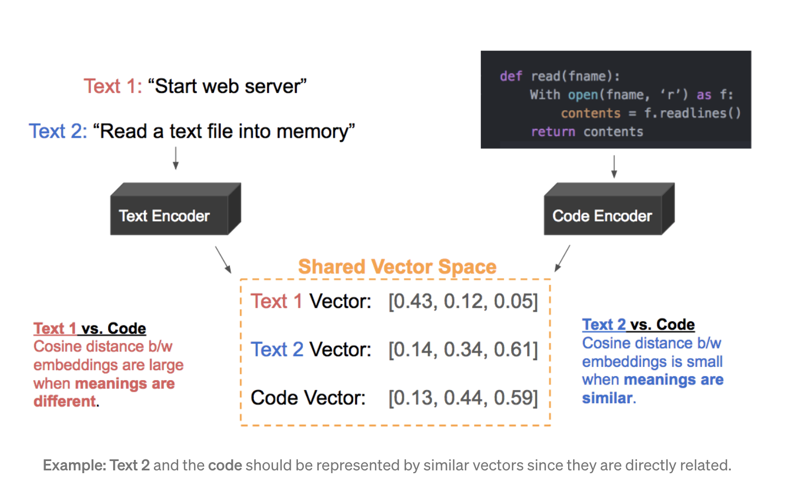

# Nashville Analytics Summit conference helper

## Overview

Since its inception in 2013 Nashville Analytics Summit event is held once a year in the months of September-October. There are dozens of talks covering analytics, data science, AI, career growth, new tools, specific industries and more. It has seen tremendous growth in sessions and participation increase.

## The problem
The recent exponential need for data and its solutions, companies are looking forward to ways to leverage data in their organizations in order meet their business objectives. This has made it challenging for participants to navigate so many sessions and presentations at Nashville Analytics Summit. Therefore, if you are thinking of attending, Nashville Analytics Summit which talks might be of interest to you? Using a sentence similarity model, we'll pick out the top 3 talks for a participant based on their description of what they hope to get out of the Session/Talk.

This project utilizes Transformers sentence similarity model multi-qa-MiniLM-L6-cos-v1 to search for abstracts that have cosine similarity that matches the search query.The user will input a phrase of or a word of interest and the model will search for similarity contexts that matches the phrase and output the top 3 sessions that matches the phrase using Transformers model semantic search over conference abstracts.

## The model
Semantic search models embed all the entries in the corpus (the abstracts) into a vector space. When the user inputs the query, its embed into the same vector space and the closest embeddings from the corpus (abstract) are found. Hence, the entries with high semantic overlap with query are ranked (high similarity at the top).

Two types of Semantic Search:
1. Symmetric - query and entries in corpus are about the same length and have same amount of content
2. Asymmetric - short query and output longer paragraphs  
This project uses Asymmetric semantic search.

## Huggingface spaces

Please take a look at my spaces at [Huggingfaces](https://huggingface.co/spaces/PBusienei/Summit_app_demo)

# Model Card

Model card is found [here](https://huggingface.co/PBusienei/Nashville_Analytics_Summit_conference_helper)

## Critical Analysis
- **speech-to-text**: Create a trained text to speech app using Speech2Text Models in conjunction with Wav2Vec2 (speech translation)
- **domain-specific**: Using domain specific may increase the accuracy of the model
- **Different-models** Trying out different models (models tuned for dot-product) that prefers retrieval of longer documents

## Code Demonstration

To run the streamlit app install streamlit in your machine

From command line/shell navigate to the abstract-search folder

Run the command below:

**streamlit run app.py**

This will open a web interface in your browser like the one below;

 *Local URL: http://localhost:8502*
  *Network URL: http://192.168.0.11:8502*

  Or click the link that was provided once you run the streamlit in your command line
  You can enter your search query in the text box given and your will get your top three Sessions of interest.

## Link to the video
Coming soon!

## Resource Links

* [Sentence Transformer](https://huggingface.co/sentence-transformers/multi-qa-MiniLM-L6-cos-v1)
* [Semantic Search S-BERT](https://medium.com/mlearning-ai/semantic-search-with-s-bert-is-all-you-need-951bc710e160)
* [Huggingface](https://huggingface.co/docs/hub/spaces)
